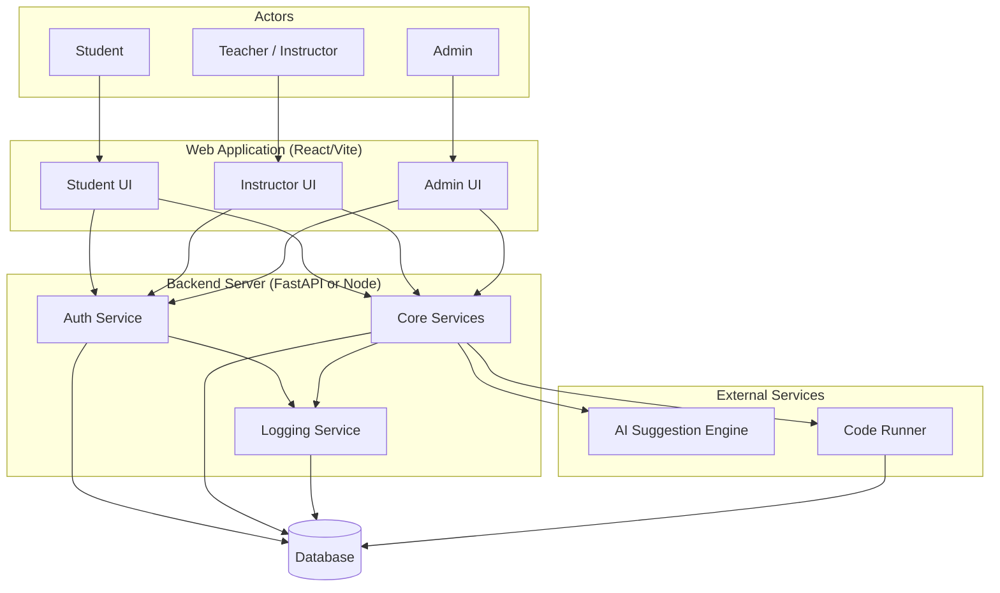
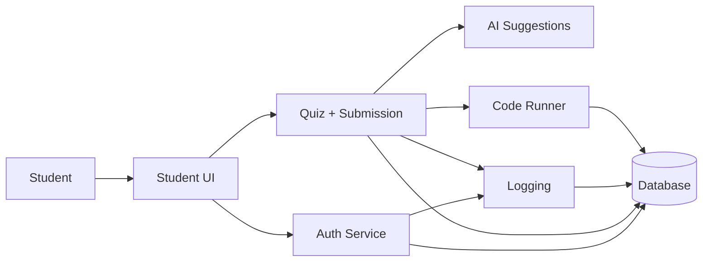
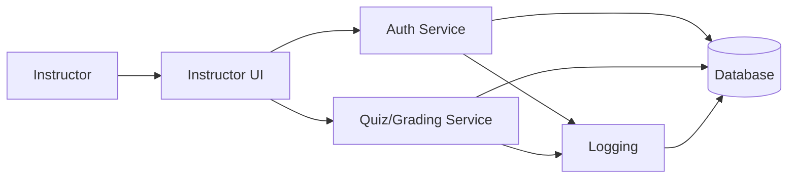
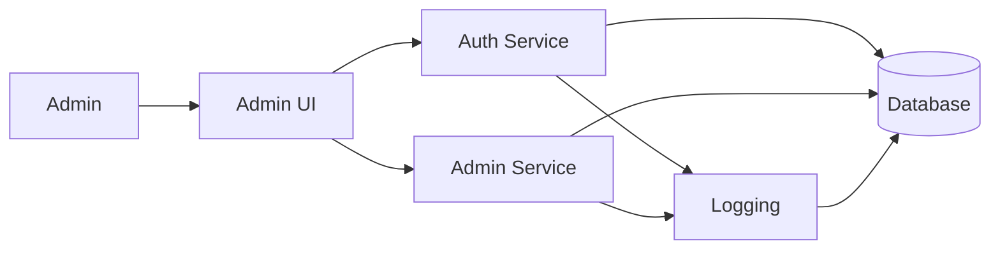

# System Block Diagram

## Complete System Overview

**Figure Description**

This block diagram gives a high-level view of the major system components (actors, UI, backend, external services and the database) and how data and requests flow between them.
The Core Services within the backend represent the primary application logic layer of the system. These services are responsible for:

Managing classes and enrollments

Creating, editing, and publishing problems and quizzes

Handling student submissions

Processing grading and feedback

Coordinating AI suggestion requests

Invoking the Code Runner for execution

Enforcing role-based permissions

The **Core Services** act as the central orchestrator of system behavior, ensuring that all user actions are validated, processed, and persisted correctly.

The **Auth Service** handles user authentication and access control, while the Logging Service records login events, quiz interactions, submissions, grading actions, and administrative operations for auditing and analytics purposes.

External services such as the AI Suggestion Engine and Code Runner are invoked by the backend but operate independently to improve modularity, scalability, and security. All persistent data is stored in the shared SQL database.

## Student Flow

**Figure Description**

This student flow diagram shows the typical path a student takes: interacting with the UI, authenticating, submitting quizzes, receiving AI suggestions or runner results, and how those interactions are logged and persisted.

## Instructor Flow

**Figure Description**

This instructor flow highlights how teacher/instructor requests (quiz creation, grading) pass through authentication and core services and are recorded in logs and the database.

## Admin Flow

**Figure Description**

This admin flow illustrates administrative actions and how they are routed through the admin service, logged, and stored in the database for auditing and recovery.
