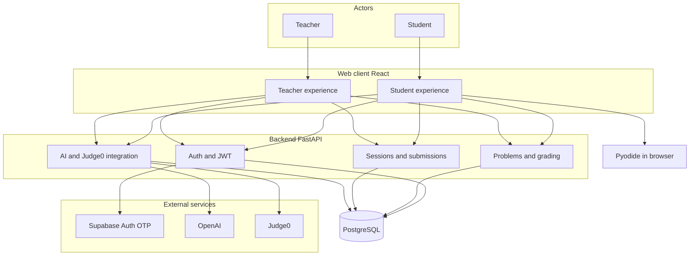
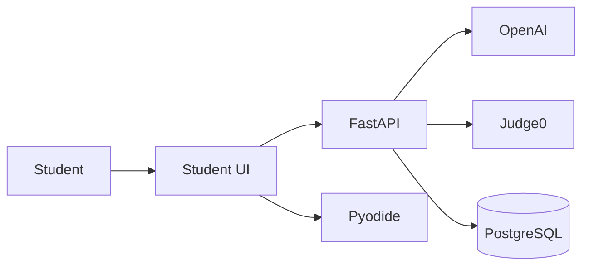
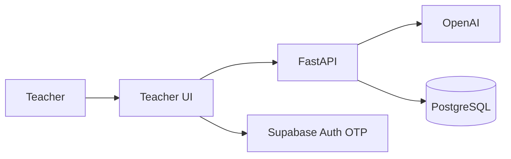

# System Block Diagram

## Complete system overview

The diagram below shows the main logical parts of the system: two actor types, one React client, the FastAPI application, external integrations, PostgreSQL, and in-browser execution for Python.

```mermaid
flowchart TB
    subgraph Actors
        S[Student]
        T[Teacher]
    end

    subgraph UI["Web client React"]
        SUI[Student experience]
        TUI[Teacher experience]
    end

    subgraph API["Backend FastAPI"]
        AUTH[Auth and JWT]
        PROB[Problems and grading]
        SESS[Sessions and submissions]
        AIJ[AI and Judge0 integration]
    end

    subgraph Ext["External services"]
        SUPA[Supabase Auth OTP]
        OAI[OpenAI]
        JUDGE[Judge0]
    end

    PY[Pyodide in browser]
    DB[(PostgreSQL)]

    S --> SUI
    T --> TUI

    SUI --> AUTH
    SUI --> PROB
    SUI --> SESS
    SUI --> AIJ
    SUI --> PY

    TUI --> AUTH
    TUI --> PROB
    TUI --> SESS
    TUI --> AIJ

    AUTH --> SUPA
    AIJ --> OAI
    AIJ --> JUDGE

    AUTH & PROB & SESS & AIJ --> DB
```

**Figure description**

- **Web client (React):** One application serves teacher flows (sign-in, dashboard, create and edit problems, review submissions) and student flows (join with an access code, editor, run tests, submit).
- **Backend (FastAPI):** Exposes authentication and JWTs, problem CRUD and grading, session lifecycle and submissions, and coordinates OpenAI and Judge0. There is no separate “logging service.” Attempt-related telemetry and similar data are written to the database as part of normal API handling.
- **External services:** Supabase supports teacher email OTP. OpenAI powers suggestions and assistive autofill. Judge0 runs non-Python code when the backend runs execution. Python for students is executed with **Pyodide in the browser**, not through Judge0 on that path.
- **PostgreSQL:** System of record for users, problems, sessions, suggestions, test cases, submissions, and related data.

## Student flow

```mermaid
flowchart LR
    S[Student] --> SUI[Student UI]
    SUI --> API[FastAPI]
    SUI --> PY[Pyodide]
    API --> OAI[OpenAI]
    API --> JUDGE[Judge0]
    API --> DB[(PostgreSQL)]
```

**Figure description**

A student uses an **access code** to load a problem, starts a **session** through the API, works in the editor with **AI suggestions** and **Pyodide** for Python (or the API plus **Judge0** for other languages), and **submits** work. The backend stores session data, telemetry, and final attempts in PostgreSQL.

## Teacher flow

```mermaid
flowchart LR
    T[Teacher] --> TUI[Teacher UI]
    TUI --> API[FastAPI]
    TUI --> SUPA[Supabase Auth OTP]
    API --> OAI[OpenAI]
    API --> DB[(PostgreSQL)]
```

**Figure description**

A teacher signs in (OTP in production, or a development login when allowed), **creates and edits problems** (optionally with AI-assisted content), and **grades** student work. Sign-in is coordinated with **Supabase**; business data and grading are stored in **PostgreSQL** through the API.
