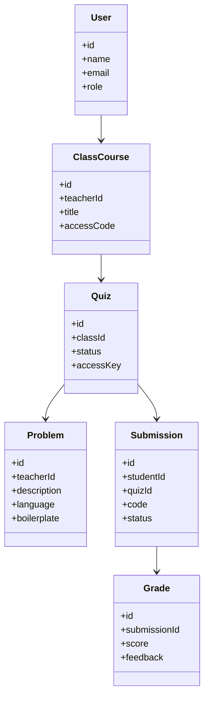

# Class Diagram

The class diagram represents the core domain model of the system, showing the main entities and their relationships.

```mermaid
classDiagram

  class User {
    +id
    +name
    +email
    +role
  }

  class ClassCourse {
    +id
    +teacherId
    +title
    +accessCode
  }

  class Problem {
    +id
    +teacherId
    +description
    +language
    +boilerplate
  }

  class Quiz {
    +id
    +classId
    +status
    +accessKey
  }

  class Submission {
    +id
    +studentId
    +quizId
    +code
    +status
  }

  class Grade {
    +id
    +submissionId
    +score
    +feedback
  }

  User --> ClassCourse
  ClassCourse --> Quiz
  Quiz --> Problem
  Quiz --> Submission
  Submission --> Grade
```
