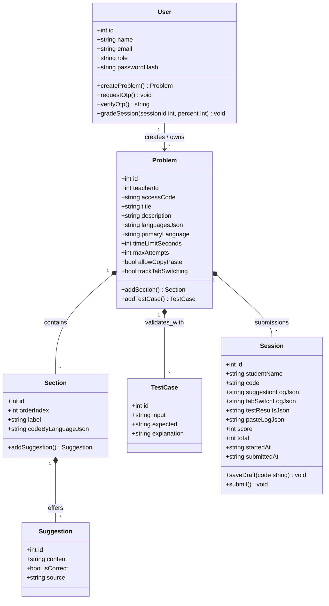

# Class Diagram

This diagram uses **explicit attribute types**, **behavior (methods)**, and **relationship semantics**. In this product, a **Problem** is the published assignment (the “quiz”); a **Session** is one student’s attempt (**submission**). A session is always tied to exactly one problem and is removed if that problem is removed—so Problem↔Session is **composition**, not shared aggregation.

## Relationship summary

| Relationship | Kind | Rationale |
|--------------|------|-----------|
| Problem → Section, TestCase, Session | **Composition** (`*--`) | Sections, test cases, and sessions are parts of a problem; they do not exist as standalone domain objects without that problem. |
| Section → Suggestion | **Composition** | Suggestions belong to one section only; they are not reused across sections. |
| User → Problem | **Association** (`-->`) | A teacher **creates** problems; ownership is by `teacherId`. (Persistence may cascade on delete; the diagram emphasizes create/ownership.) |

## Class diagram

### Notes on types

- **IDs** are integers in PostgreSQL (`SERIAL`).
- **JSON payloads** stored as text in the database are shown as `string` with a `Json` suffix (e.g. `languagesJson`, `codeByLanguageJson`, log fields).
- **Student identity** is carried on `Session.studentName`; students using the access-code flow are not required to have a `User` record. `submit()` and `saveDraft()` represent the submission lifecycle exposed by the submissions API.