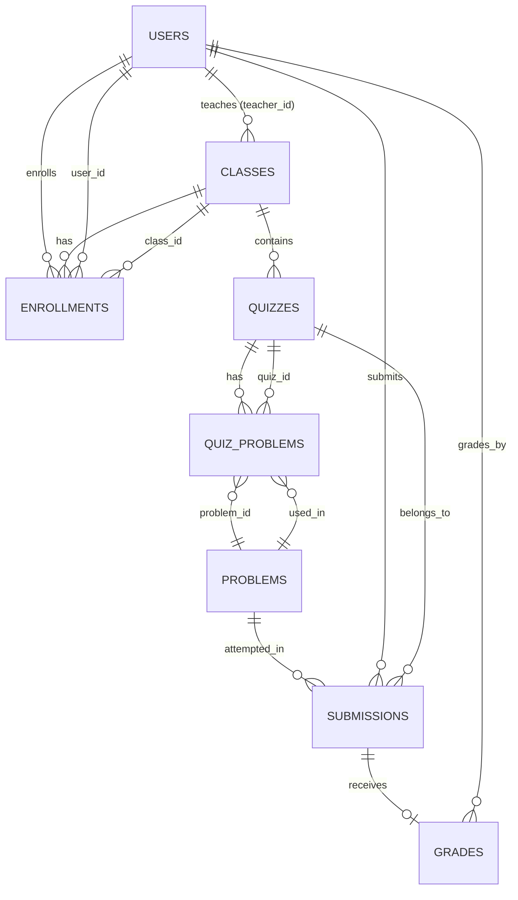

# Database Design

## Entity-Relationship Diagram

---

## Table Overview

The system database contains the following minimum required tables:

- `users`
- `classes`
- `enrollments`
- `problems`
- `quizzes`
- `submissions`
- `grades`
- `suggestion_events`
- `event_logs`

Each table uses:

- **Primary Keys (PK)** to uniquely identify records  
- **Foreign Keys (FK)** to maintain referential integrity  
- Appropriate indexing for performance optimization  

These constraints ensure data consistency and prevent orphaned or invalid records.
