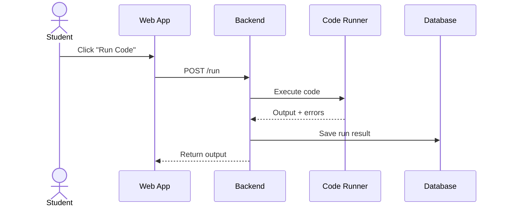
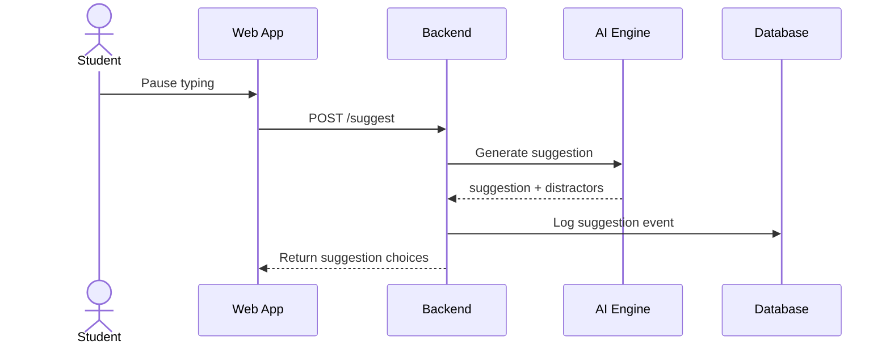
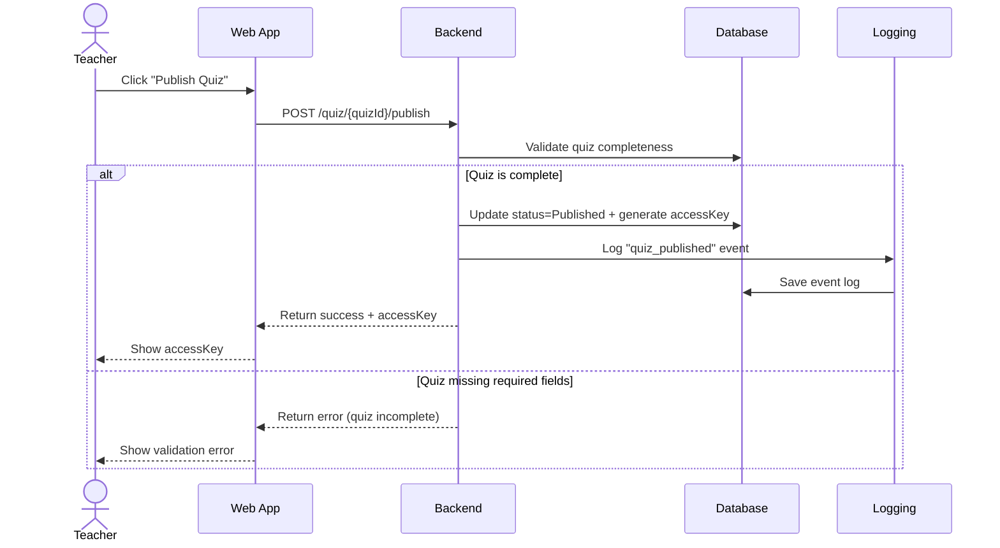
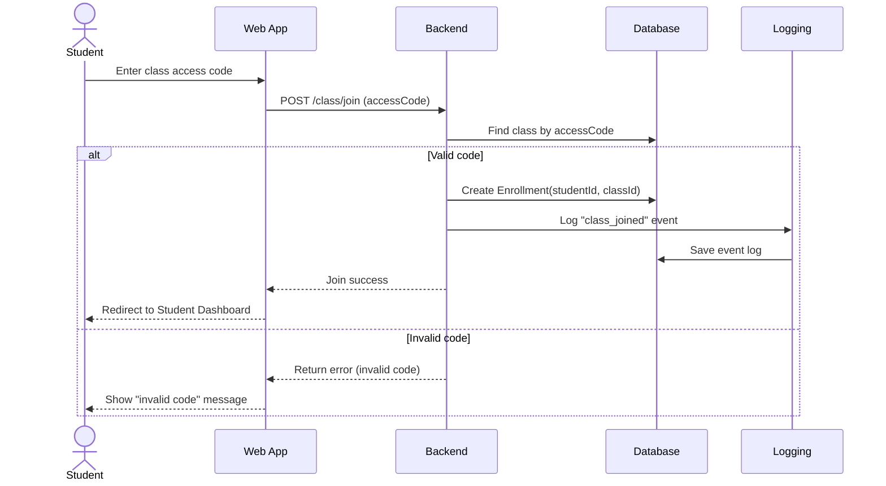
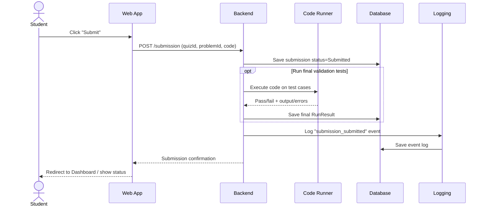
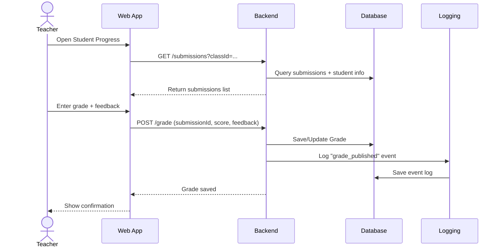
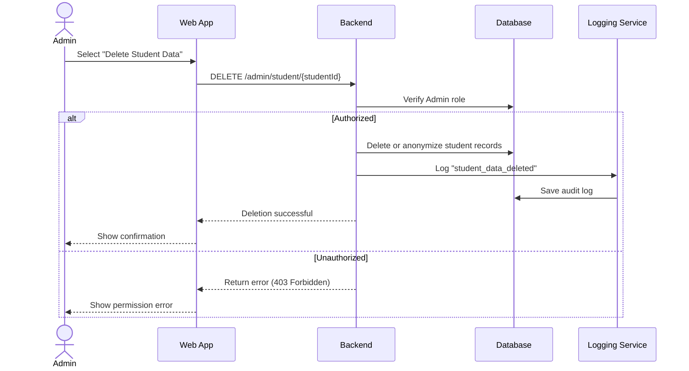
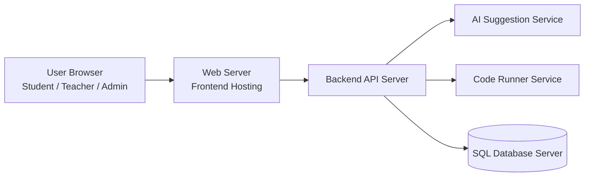

# Design

This document describes the software architecture of the **AutoSuggestion Quiz** system and explains how the requirements are mapped into the design.

The architecture is designed to:
- Support critical evaluation of AI-generated code suggestions
- Provide secure role-based access control
- Maintain low-latency code suggestions
- Log all meaningful interactions
- Store all persistent data in a shared database

---

## 1. High-Level Architecture

### 1.1 System Block Diagram

```mermaid
flowchart LR
  %% ===== Actors =====
  S[Student]
  T[Teacher / Instructor]
  A[Admin]

  %% ===== Client =====
  subgraph Client[Client - Web App]
    UI[React/Vite UI<br/>Dashboards + Code Editor + Terminal View]
  end

  %% ===== Backend =====
  subgraph Backend[Backend API - FastAPI or Node.js]
    AUTH[Authentication<br/>Edu ID or Email/Password]
    PROB[Problem + Quiz Management<br/>Upload - Edit - Publish]
    QUIZ[AutoSuggestion Quiz<br/>Suggestions + Explanations]
    RUN[Code Runner<br/>Run Code + Output]
    GRADE[Grading + Analytics<br/>Progress + Grades]
    LOG[Logging + Event Tracking]
  end

  %% ===== AI Engine =====
  subgraph AIBlock[AI Suggestion Engine]
    AI[LLM Suggestion Engine<br/>Distractors + Optional Explanations]
  end

  %% ===== Data =====
  subgraph Data[Shared Data Layer]
    DB[(Shared Database<br/>Users Classes Problems Submissions Grades Logs)]
  end

  %% ===== Main Flows =====
  S --> UI
  T --> UI
  A --> UI

  UI --> AUTH
  UI --> PROB
  UI --> QUIZ
  UI --> RUN
  UI --> GRADE

  QUIZ --> AI

  AUTH --> DB
  PROB --> DB
  QUIZ --> DB
  RUN --> DB
  GRADE --> DB
  LOG --> DB

  QUIZ --> LOG
  PROB --> LOG
  RUN --> LOG
  GRADE --> LOG
  ```

### 1.2 Architectural Overview

The system consists of five primary components:

1. **Web Application (Frontend)** – User interface for students, teachers, and admins.

2. **Backend API Server** – Handles authentication, business logic, permissions, and orchestration.

3. **AI Suggestion Engine** – Generates next-line suggestions, explanations, and distractors.

4. **Code Runner Service** – Executes and compiles code safely in isolation.

5. **Shared SQL Database** – Stores users, classes, problems, submissions, grades, and logs.

This modular structure ensures separation of concerns and allows independent improvements of each component.

---

## 2. Component Descriptions

### 2.1 Web Application (React/Vite)

**Type**: Client Interface

**Purpose**: Provide interactive UI for all user roles.

**Responsibilities**:

* Login and registration

* Student code editor and terminal

* Quiz interface (AutoSuggestion mode)

* Teacher dashboard (problem creation, grading)

* Admin panel

**Interface**:

* Communicates with Backend API using REST over HTTPS.

 

### 2.2 Backend API Server (FastAPI or Node.js)

**Type**: Application Logic Layer  

**Purpose**: Central control of business logic, authentication, permissions, and coordination between services.

**Responsibilities**:

* Authenticate users (Edu ID or email/password)
* Enforce role-based access control (Student / Teacher / Admin)
* Manage classes, problems, quizzes, and access keys
* Handle submissions and grading
* Request AI-generated suggestions
* Send code to Code Runner for execution
* Log system events and interactions
* Provide analytics endpoints

**Dependencies**:

* Shared SQL Database
* AI Suggestion Engine
* Code Runner Service

**Interface**:

* REST API (JSON over HTTPS)
* Example endpoints:
  * `POST /auth/login`
  * `POST /quiz`
  * `POST /run`
  * `POST /suggest`
  * `GET /analytics`


### 2.3 AI Suggestion Engine

**Type**: Intelligent Service Component  

**Purpose**: Generate context-aware next-line code suggestions.

**Inputs**:

* Problem description
* Student’s current code
* Programming language
* Cursor position / context

**Outputs**:

* Correct next-line suggestion
* Distractors (0–2 plausible incorrect options)
* Optional explanation

**Performance Considerations**:

* Asynchronous API calls
* Timeout handling
* Optional caching of repeated prompts


### 2.4 Code Runner Service

**Type**: Execution Service  

**Purpose**: Safely compile and execute student code in a sandboxed environment.

**Supported Languages**:

* Python
* Java
* C
* JavaScript

**Responsibilities**:

* Compile (if necessary)
* Execute code with test cases
* Return stdout, stderr, exit code, runtime
* Enforce memory and time limits

**Security Considerations**:

* Code runs in isolated environment
* Resource usage restrictions applied


### 2.5 Shared SQL Database

**Type**: Persistent Storage Layer  

**Purpose**: Maintain all system data.

**Stores**:

* Users (students, teachers, admins)
* Classes and enrollments
* Problems and quizzes
* Submissions
* Grades and feedback
* Suggestion events
* Event logs

**Design Goals**:

* Single source of truth
* Indexed queries for performance
* Referential integrity via foreign keys

---

## 3. Class Diagram (Core Domain Model)

```mermaid
classDiagram

  class User {
    +id
    +name
    +email
    +role
  }

  class ClassCourse {
    +id
    +teacherId
    +title
    +accessCode
  }

  class Problem {
    +id
    +teacherId
    +description
    +language
    +boilerplate
  }

  class Quiz {
    +id
    +classId
    +status
    +accessKey
  }

  class Submission {
    +id
    +studentId
    +quizId
    +code
    +status
  }

  class Grade {
    +id
    +submissionId
    +score
    +feedback
  }

  User --> ClassCourse
  ClassCourse --> Quiz
  Quiz --> Problem
  Quiz --> Submission
  Submission --> Grade
```
  ---

## 4. Sequence Diagram

### 4.1 Student Runs Code


### 4.2 Student Recieves Code Suggestions

### 4.3 Teacher Publishes Quiz (Generates Access Key)



### 4.4 Student Joins Class Using Access Code


### 4.5 Student Submits Completed Work


### 4.6 Teacher Grades Student Submission


### 4.7 Admin Deletes Student Data

---
## 5. Database Design

### 5.1 Entity-Relationship Diagram
```mermaid
erDiagram
  USERS ||--o{ CLASSES : "teaches (teacher_id)"
  USERS ||--o{ ENROLLMENTS : enrolls
  CLASSES ||--o{ ENROLLMENTS : has
  CLASSES ||--o{ QUIZZES : contains
  QUIZZES ||--o{ QUIZ_PROBLEMS : has
  PROBLEMS ||--o{ QUIZ_PROBLEMS : used_in
  PROBLEMS ||--o{ SUBMISSIONS : attempted_in
  USERS ||--o{ SUBMISSIONS : submits
  QUIZZES ||--o{ SUBMISSIONS : belongs_to
  SUBMISSIONS ||--o| GRADES : receives
  USERS ||--o{ GRADES : grades_by
  %% Supporting tables
  ENROLLMENTS }o--|| USERS : "user_id"
  ENROLLMENTS }o--|| CLASSES : "class_id"
  QUIZ_PROBLEMS }o--|| QUIZZES : "quiz_id"
  QUIZ_PROBLEMS }o--|| PROBLEMS : "problem_id"
  ```

## 5.2 Table Overview

The system database contains the following minimum required tables:

- `users`
- `classes`
- `enrollments`
- `problems`
- `quizzes`
- `submissions`
- `grades`
- `suggestion_events`
- `event_logs`

Each table uses:

- **Primary Keys (PK)** to uniquely identify records  
- **Foreign Keys (FK)** to maintain referential integrity  
- Appropriate indexing for performance optimization  

These constraints ensure data consistency and prevent orphaned or invalid records.

---

## 6. AI Algorithm Overview

The AI Suggestion Engine follows this structured workflow:

1. Receive context:
   - Problem description
   - Student’s current code
   - Programming language
   - Cursor position

2. Generate next-line suggestion using a Large Language Model (LLM).

3. Optionally generate an explanation for the suggestion.

4. If in quiz mode:
   - Generate 0–2 plausible distractors.

5. Return a structured JSON response to the backend API.

Example JSON structure:

```json
{
  "suggestion": "for i in range(n):",
  "distractors": [
    "for i in n:",
    "while i < n:"
  ],
  "explanation": "This iterates from 0 to n-1."
}
```
**Performance Considerations**

To maintain low latency and responsiveness:

* Asynchronous API calls are used.

* Timeout thresholds are enforced.

* Optional caching may be applied for repeated prompts.

* AI calls are isolated from core backend logic.

---

## 7. Cross-Cutting Concerns

Cross-cutting concerns apply to multiple components of the system and ensure reliability, security, and maintainability.

### 7.1 Security

Security is enforced across all layers of the system.

The following mechanisms are implemented:

- **Role-Based Access Control (RBAC)**  
  Users are assigned roles (Student, Teacher, Admin), and permissions are enforced accordingly.

- **Authentication for Protected Endpoints**  
  All protected API routes require a valid authentication token.

- **Admin-Only Route Restrictions**  
  Administrative actions (e.g., deleting quizzes, deleting student data) are restricted via backend middleware checks.

- **Secure Communication (HTTPS)**  
  All client-server communication occurs over encrypted HTTPS connections.

- **Sandboxed Code Execution**  
  Student code is executed in an isolated environment with resource limits to prevent system compromise.

### 7.2 Logging

All meaningful system interactions are recorded to ensure traceability and analytics support.

The system logs:

- Suggestion selections stored in the `suggestion_events` table
- Code submissions stored in the `submissions` table
- Administrative actions recorded in the `event_logs` table
- System errors captured for debugging and monitoring

Logging ensures:

- Accountability
- Auditability
- Performance analysis
- Debugging support

### 7.3 Performance

System performance is optimized using the following strategies:

- Indexed database queries for fast lookups
- Asynchronous AI calls to prevent blocking
- Asynchronous code runner execution
- Separation of services to reduce coupling

### 7.4 Exception Handling

The system includes structured error handling at all architectural layers.

- Backend API routes return standardized HTTP status codes (200, 400, 401, 403, 500).
- Validation errors are handled before business logic execution.
- AI service timeouts return graceful fallback responses.
- Code Runner failures (compile errors, runtime errors, timeouts) are captured and returned safely.
- All critical exceptions are logged in the `event_logs` table.

This ensures predictable system behavior and improved debugging capability.

### 7.5 Initialization and Reset

The system supports proper initialization and recovery mechanisms:

- Backend services initialize database connections at startup.
- Environment variables configure external dependencies.
- Code Runner containers are initialized per execution and destroyed afterward.
- Database migrations ensure schema consistency.
- Application restart does not corrupt persistent data.

This guarantees stability across deployments and restarts.

### 7.6 Memory Management

Memory management is addressed through:

- Resource-limited sandbox execution for Code Runner.
- Timeout thresholds on AI and execution requests.
- Automatic garbage collection provided by the runtime (Python / Node.js).
- Avoidance of long-lived in-memory state on the backend.

This prevents resource exhaustion and denial-of-service risks.

### 7.7 Internationalization

The current system is designed in English.

Future internationalization can be supported by:

- Externalizing UI strings.
- Language-based configuration.
- UTF-8 encoding support in database and API responses.

The architecture does not restrict future multi-language support.

### 7.8 Built-in Help

The system supports user guidance through:

- Inline explanations for AI suggestions.
- Dashboard feedback messages.
- Validation error messages.
- Contextual tooltips in the user interface.

Future versions may include:
- Interactive tutorials.
- Help documentation pages.
- Onboarding walkthroughs.

### 7.9 Built-in Test Facilities

Testing support is incorporated at multiple layers:

- Unit testing of backend services.
- API endpoint testing.
- Code Runner validation against predefined test cases.
- Logging system for auditing behavior.
- Automated frontend component testing.

These facilities ensure system reliability and regression prevention.

---

## 8. Deployment View (Physical Architecture)

The physical architecture describes how system components are deployed across hardware or cloud infrastructure.



Deployment Description

- **Web Server** — Serves the frontend static assets to client browsers, terminates TLS, and can be fronted by a CDN or edge layer for low-latency delivery.

- **Backend API Server** — Hosts the REST API and business logic, enforces authentication and RBAC, and mediates access to AI, Runner, and the database.

- **AI Suggestion Service** — May run as an external managed API or an internal service; accessed over authenticated HTTPS and scaled independently to meet latency requirements.

- **Code Runner Service** — Executes untrusted student code in sandboxed containers/VMs with strict CPU/memory/time limits, network restrictions, and isolation from production systems.

- **Database Server** — Single source of truth (managed SQL instance) reachable only from trusted backend components; configured with backups, replication, and network-level access controls.

- **Separation benefits**
    - Scalability — each service (frontend, API, AI, runner, DB) can scale independently.
    - Maintainability — clear responsibilities and well-defined interfaces make components replaceable and easier to develop.
    - Security — network isolation, least-privilege access, and sandboxed execution reduce blast radius and improve compliance.

---

## 9. Development View (Project Structure)

The development view describes how the codebase is organized.

Recommended project structure:

```text
/frontend
  /components
  /pages
  /services
  main.jsx

/backend
  /routes
  /controllers
  /services
  /models
  app.py (or server.js)

/ai
  suggestion_engine.py
  prompt_builder.py

/code-runner
  runner_service.py

/database
  schema.sql
  migrations/

/docs
  Docusaurus documentation
```

Development Design Principles

- Clear separation between frontend and backend.
- Service-oriented backend design.
- AI logic isolated from core API logic.
- Database schema separated from application logic.

This structure enables independent development and testing of components.

---

## 10. Interface Specifications

### 10.1 Suggestion Endpoint

Endpoint: POST /suggest

Input (JSON):

```json
{
  "problemId": 123,
  "code": "string",
  "language": "string",
  "cursorPosition": { "line": 10, "column": 5 }
}
```

Output (JSON):

```json
{
  "suggestion": "string",
  "distractors": ["string"],
  "explanation": "string"
}
```

Precondition:

- User must be authenticated.
- User must be enrolled in the class.

Postcondition:

- Suggestion event stored in `suggestion_events`.

### 10.2 Run Code Endpoint

Endpoint: POST /run

Input:

```json
{
  "code": "string",
  "language": "string",
  "testCases": []
}
```

Output:

```json
{
  "stdout": "string",
  "stderr": "string",
  "exitCode": 0,
  "runtimeMs": 123
}
```

Precondition:

- Authenticated user.
- Valid language supported.

Postcondition:

- Run result optionally stored in database.

---

## 11. Process View (Concurrency and Control Flow)

The system supports concurrent users and asynchronous service calls.

Request Lifecycle

1. Client sends request to Backend API.
2. Backend validates authentication and role.
3. Backend processes request:
   - For AI requests: asynchronous call to AI service.
   - For code execution: isolated runner process.
4. Backend waits for response (non-blocking).
5. Backend logs event and returns response.

Concurrency Model

- Backend supports concurrent HTTP requests.
- AI and Code Runner calls are asynchronous.
- Resource limits prevent blocking.
- Database transactions ensure consistency.

---

## 12. Architecture Evaluation

### 12.1 Alternatives Considered

Monolithic Architecture

- All services tightly integrated.
- Rejected due to scalability and maintainability concerns.

Microservices Architecture

- Fully separated services.
- Considered excessive for current project scope.

### 12.2 Chosen Architecture

A modular layered architecture was selected because:

- Clear separation of concerns.
- Independent scalability of AI and runner services.
- Simpler integration compared to full microservices.

---

## 13. Non-Functional Requirements

The architecture addresses the following non-functional requirements:

### Security

- Role-based access control.
- Sandboxed execution.
- HTTPS communication.

### Performance

- Asynchronous AI calls.
- Indexed database queries.
- Service isolation.

### Scalability

- AI and runner services can scale independently.
- Database optimized with indexing.

### Maintainability

- Modular code organization.
- Clear component responsibilities.
- Minimal coupling between services.

---

## 14. Flexibility and Future Changes

The architecture supports future enhancements:

- Adding additional programming languages.
- Replacing the AI model without modifying core backend logic.
- Introducing caching layers.
- Adding analytics dashboards.

