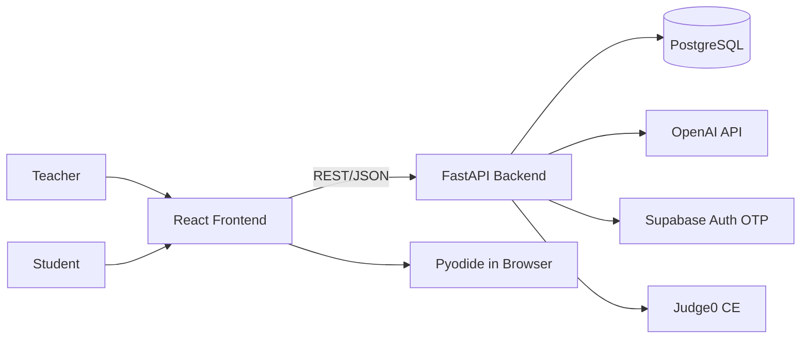
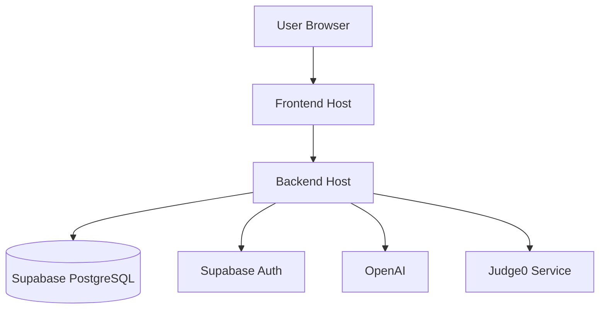

# Overview

AutoSuggestion Quiz is a web platform where teachers create structured coding problems and students solve them with AI-assisted next-line suggestions. The current architecture is a React frontend + FastAPI backend + PostgreSQL database, with OpenAI, Supabase OTP, and Judge0/Pyodide integrations.

## Architecture goals

- Keep the student coding experience responsive while suggestions and execution run.
- Give teachers a full workflow for problem creation, access-code distribution, and grading.
- Preserve attempt telemetry (suggestion usage, tab switches, paste events, test runs) for review.
- Keep authentication simple for production (OTP) and practical for development (`/auth/dev-login`).

## Main components

### Frontend (`frontend/`)

- React (Create React App) SPA with Monaco editor.
- Core pages: `LoginPage`, `Dashboard`, `CreateProblemPage`, `ProblemPage`, `ReviewPage`.
- Calls backend REST APIs for authentication, problem management, suggestions, submissions, and grading.
- Uses Pyodide in browser for Python execution; falls back to backend execution for non-Python languages.

### Backend (`backend/`)

- FastAPI app with router modules:
  - `/auth` (OTP/login/dev-login/JWT)
  - `/problems` (teacher CRUD, code lookup, grading)
  - `/submissions` (start/draft/submit attempts)
  - `/ai` (suggestion + problem autofill)
  - `/code` (Judge0 execution)
  - `/quiz` (authenticated quiz attempts)
- Uses `psycopg2` with `DATABASE_URL` (no ORM).
- Stores JSON-like payloads as serialized text in several columns.

### Database (PostgreSQL)

- Primary entities: `users`, `problems`, `sections`, `suggestions`, `test_cases`, `sessions`.
- `quiz_attempts` and `quiz_answers` support the `/quiz` API alongside the main problem and session model.
- Submission telemetry is persisted in `sessions` (`suggestion_log`, `tab_switch_log`, `paste_log`, `test_results`).

### External services

- **OpenAI** (`gpt-4o-mini`) for AI suggestions and teacher problem autofill.
- **Supabase Auth** OTP endpoints for teacher email login bootstrap.
- **Judge0** for non-Python code execution via `/code/execute`.
- **Pyodide** in the browser for Python runtime and test checks.

## Logical architecture

## Deployment view

How components are deployed in a typical setup (browser, hosted SPA, API, database, and external services).

- Backend CORS allows the local dev frontend and the deployed frontend origin.
- The documentation site is built and deployed through the repository’s continuous integration pipeline.
- For non-Python execution, Judge0 can be run locally using the helper scripts in the repository root.

REST request/response details and per-endpoint behavior are documented under [Interface specifications](../api-specification/interface-specifications).
