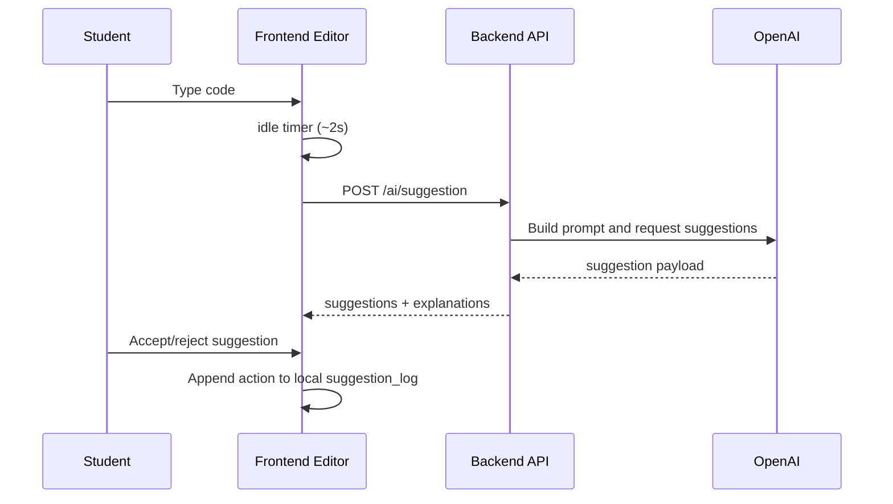

# Process View

This view describes the runtime flow of login, authoring, solving, autosaving, and submission.

## End-to-end runtime flow

1. Teacher logs in via OTP (`/auth/otp/request` + `/auth/otp/verify`) or dev bypass in debug.
2. Teacher creates a problem (`/problems/`) with sections, suggestions, and tests.
3. Student enters problem access code (`/problems/access/{code}`).
4. Student session starts/resumes (`/submissions/start`).
5. Student works in Monaco editor:
   - AI suggestions requested after idle pauses (`/ai/suggestion`).
   - Draft autosaved through `PUT /submissions/{id}/draft`.
   - Python execution runs in-browser via Pyodide.
   - Other languages run through backend `POST /code/execute`.
6. Student submits final code + telemetry logs (`POST /submissions/{id}/submit`).
7. Teacher reviews attempts from `GET /problems/` and can grade (`POST /problems/{problem_id}/grade`).

## Concurrency and state model

- FastAPI handles concurrent HTTP requests with independent DB connections per request path.
- Long-latency operations (OpenAI, Supabase, Judge0) are handled through async HTTP calls.
- Student attempt state is persisted server-side in `sessions` instead of memory.
- Draft-based persistence supports interruption recovery (refresh/reopen continues unfinished attempt).

## Editor interaction loop

## Submission process

- Drafts and final submissions are distinct operations:
  - Draft: mutable, no `submitted_at`.
  - Submit: writes telemetry JSON and sets `submitted_at = NOW()`.
- Attempt limits are enforced using existing submitted session counts per student/problem.
- Grading updates session `score`/`total`, allowing both auto-derived and manual review workflows.