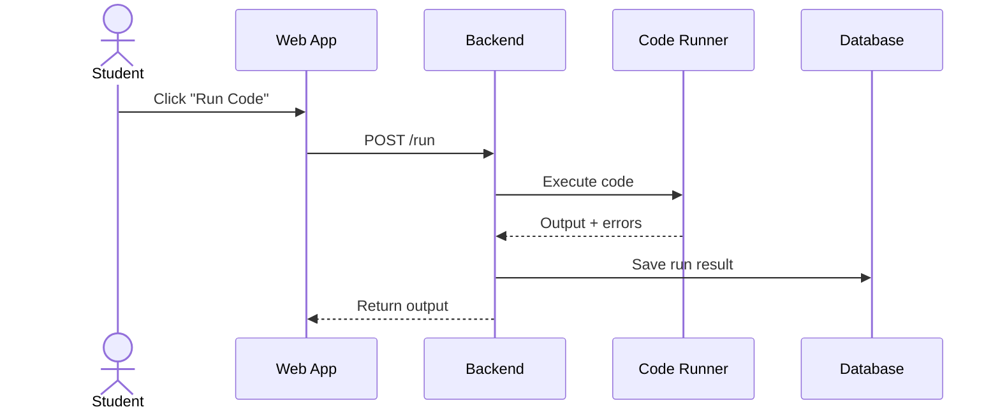
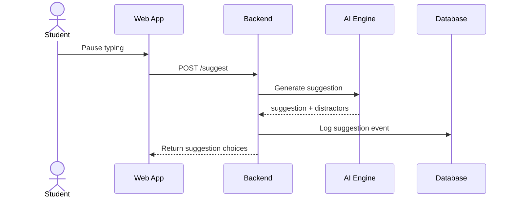
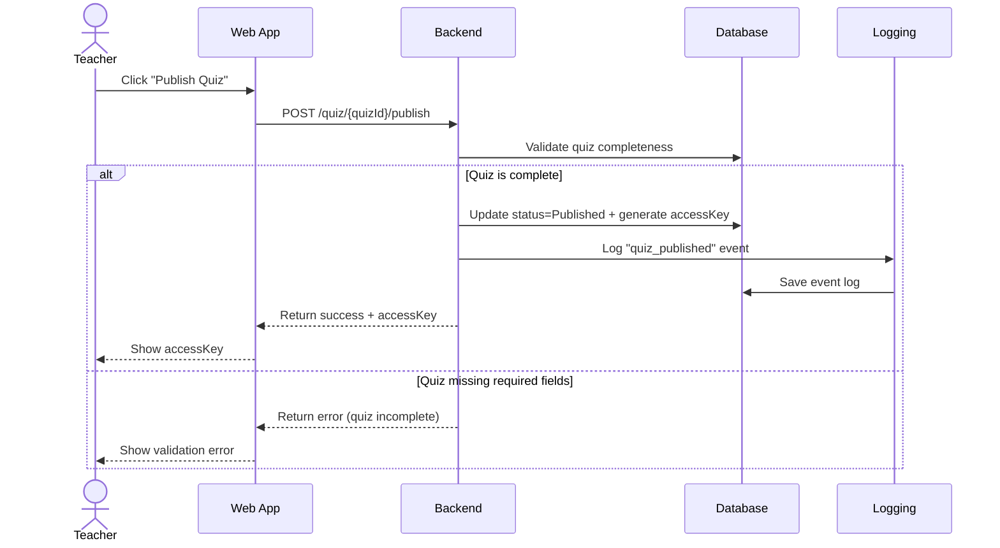
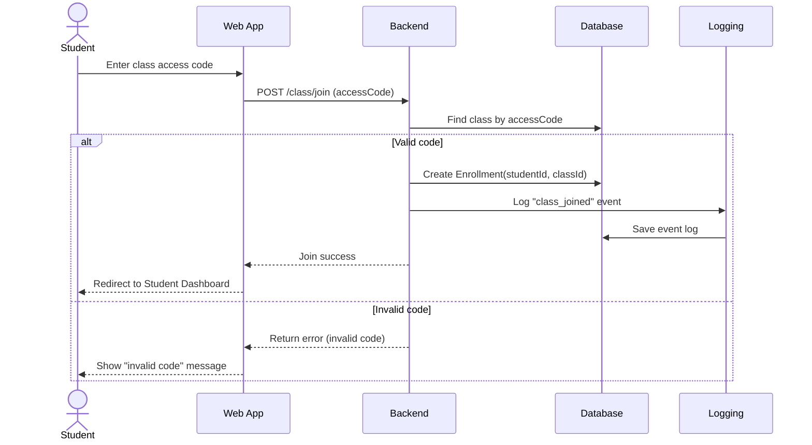
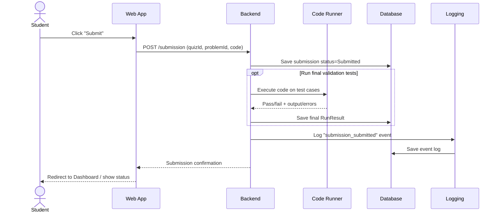
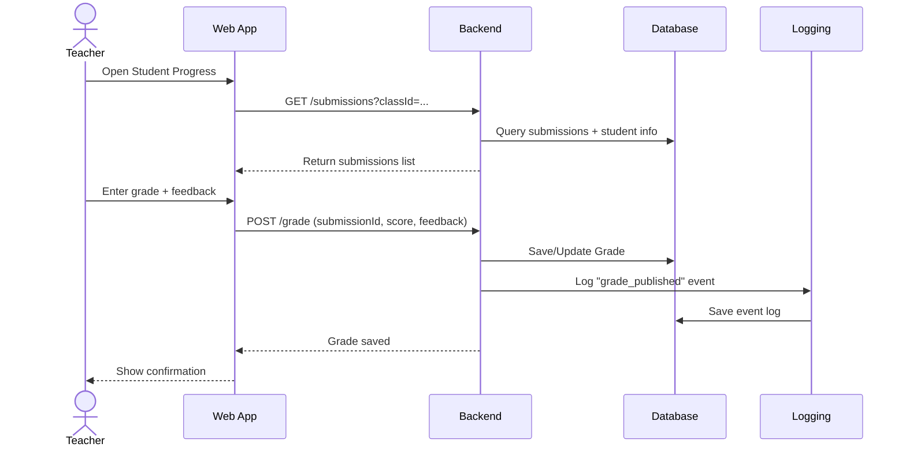
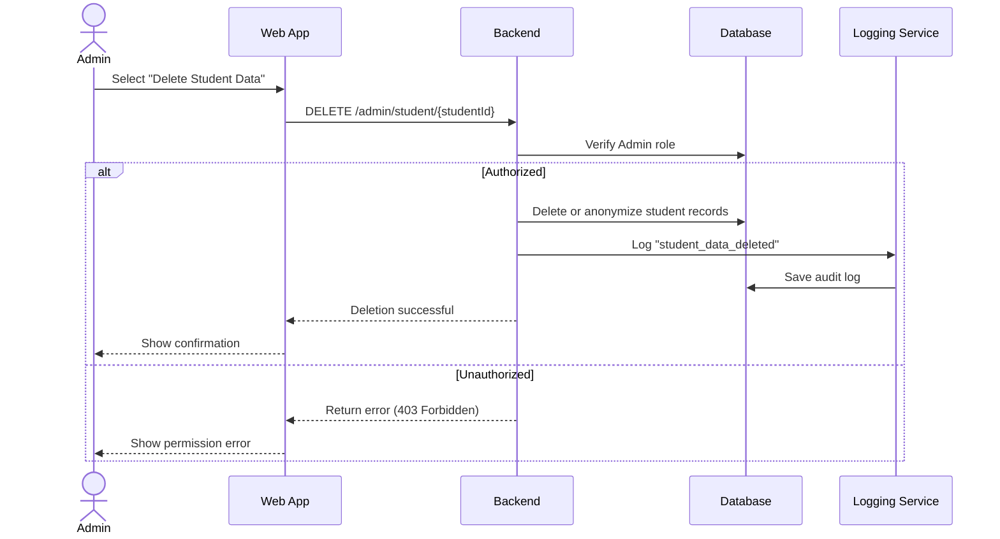

# Sequence Diagrams

The following sequence diagrams illustrate the key interactions between system components.

---

## Student Runs Code

---

## Student Receives Code Suggestions

---

## Teacher Publishes Quiz (Generates Access Key)

---

## Student Joins Class Using Access Code

---

## Student Submits Completed Work

---

## Teacher Grades Student Submission

---

## Admin Deletes Student Data

