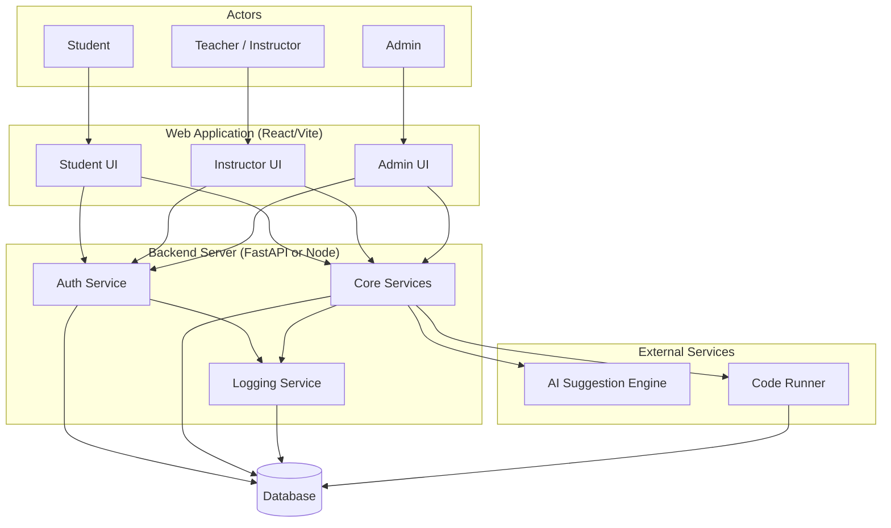
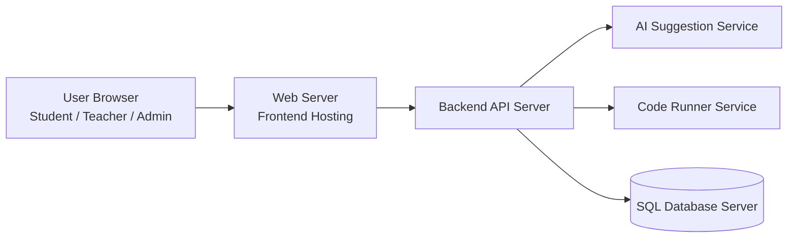

# System Architecture

This page covers deployment, development structure, interface specifications, architecture evaluation, and non-functional requirements.

---

## System Bock Diagram



**Figure Description**

This block diagram gives a high-level view of the major system components (actors, UI, backend, external services and the database) and how data and requests flow between them.
The Core Services within the backend represent the primary application logic layer of the system. These services are responsible for:

Managing classes and enrollments

Creating, editing, and publishing problems and quizzes

Handling student submissions

Processing grading and feedback

Coordinating AI suggestion requests

Invoking the Code Runner for execution

Enforcing role-based permissions

The **Core Services** act as the central orchestrator of system behavior, ensuring that all user actions are validated, processed, and persisted correctly.

The **Auth Service** handles user authentication and access control, while the Logging Service records login events, quiz interactions, submissions, grading actions, and administrative operations for auditing and analytics purposes.

External services such as the AI Suggestion Engine and Code Runner are invoked by the backend but operate independently to improve modularity, scalability, and security. All persistent data is stored in the shared SQL database.

---

## Deployment View (Physical Architecture)

The physical architecture describes how system components are deployed across hardware or cloud infrastructure.



### Deployment Description

- **Web Server** — Serves the frontend static assets to client browsers, terminates TLS, and can be fronted by a CDN or edge layer for low-latency delivery.

- **Backend API Server** — Hosts the REST API and business logic, enforces authentication and RBAC, and mediates access to AI, Runner, and the database.

- **AI Suggestion Service** — May run as an external managed API or an internal service; accessed over authenticated HTTPS and scaled independently to meet latency requirements.

- **Code Runner Service** — Executes untrusted student code in sandboxed containers/VMs with strict CPU/memory/time limits, network restrictions, and isolation from production systems.

- **Database Server** — Single source of truth (managed SQL instance) reachable only from trusted backend components; configured with backups, replication, and network-level access controls.

### Separation Benefits

- **Scalability** — each service (frontend, API, AI, runner, DB) can scale independently.
- **Maintainability** — clear responsibilities and well-defined interfaces make components replaceable and easier to develop.
- **Security** — network isolation, least-privilege access, and sandboxed execution reduce blast radius and improve compliance.

---

## Development View (Project Structure)

The development view describes how the codebase is organized.

Recommended project structure:

```text
/frontend
  /components
  /pages
  /services
  main.jsx

/backend
  /routes
  /controllers
  /services
  /models
  app.py (or server.js)

/ai
  suggestion_engine.py
  prompt_builder.py

/code-runner
  runner_service.py

/database
  schema.sql
  migrations/

/docs
  Docusaurus documentation
```

### Development Design Principles

- Clear separation between frontend and backend.
- Service-oriented backend design.
- AI logic isolated from core API logic.
- Database schema separated from application logic.

This structure enables independent development and testing of components.

---

## Interface Specifications

### Suggestion Endpoint

**Endpoint**: `POST /suggest`

**Input (JSON)**:

```json
{
  "problemId": 123,
  "code": "string",
  "language": "string",
  "cursorPosition": { "line": 10, "column": 5 }
}
```

**Output (JSON)**:

```json
{
  "suggestion": "string",
  "distractors": ["string"],
  "explanation": "string"
}
```

**Precondition**:

- User must be authenticated.
- User must be enrolled in the class.

**Postcondition**:

- Suggestion event stored in `suggestion_events`.

### Run Code Endpoint

**Endpoint**: `POST /run`

**Input**:

```json
{
  "code": "string",
  "language": "string",
  "testCases": []
}
```

**Output**:

```json
{
  "stdout": "string",
  "stderr": "string",
  "exitCode": 0,
  "runtimeMs": 123
}
```

**Precondition**:

- Authenticated user.
- Valid language supported.

**Postcondition**:

- Run result optionally stored in database.

---

## Architecture Evaluation

### Alternatives Considered

**Monolithic Architecture**

- All services tightly integrated.
- Rejected due to scalability and maintainability concerns.

**Microservices Architecture**

- Fully separated services.
- Considered excessive for current project scope.

### Chosen Architecture

A modular layered architecture was selected because:

- Clear separation of concerns.
- Independent scalability of AI and runner services.
- Simpler integration compared to full microservices.

---

## Non-Functional Requirements

The architecture addresses the following non-functional requirements:

### Security

- Role-based access control.
- Sandboxed execution.
- HTTPS communication.

### Performance

- Asynchronous AI calls.
- Indexed database queries.
- Service isolation.

### Scalability

- AI and runner services can scale independently.
- Database optimized with indexing.

### Maintainability

- Modular code organization.
- Clear component responsibilities.
- Minimal coupling between services.

---

## Flexibility and Future Changes

The architecture supports future enhancements:

- Adding additional programming languages.
- Replacing the AI model without modifying core backend logic.
- Introducing caching layers.
- Adding analytics dashboards.
